# Hostel Allotment System

A Major Project developed as part of the B.Tech (CSE) curriculum.

## 📸 Project Images
## Home Page
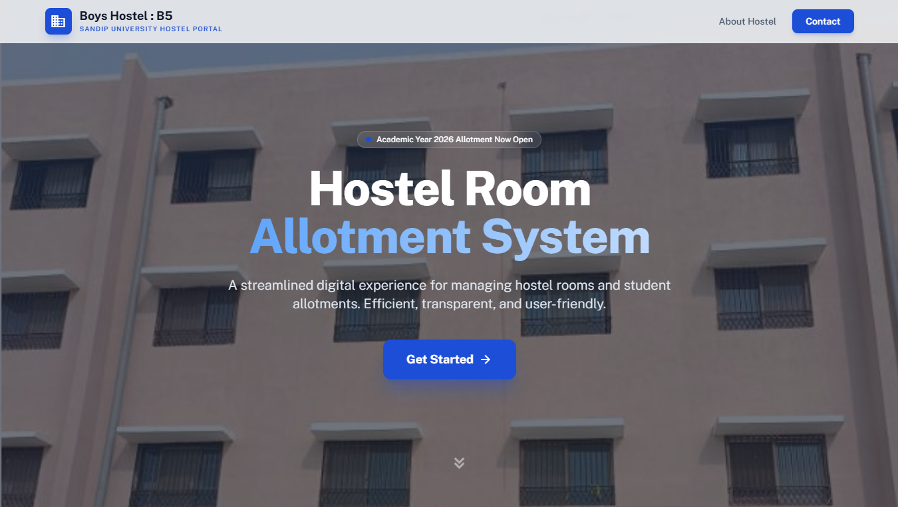
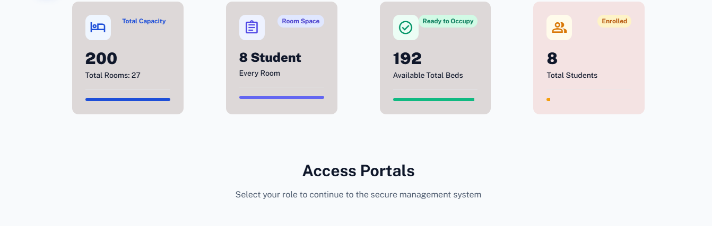
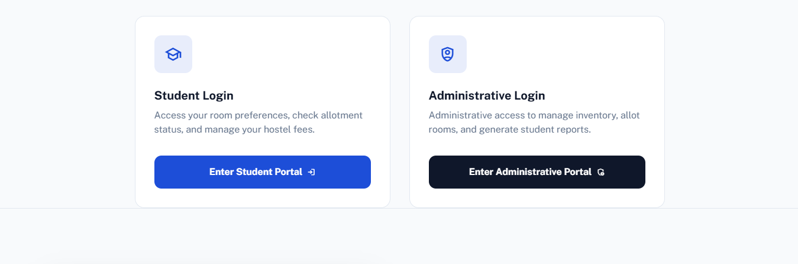
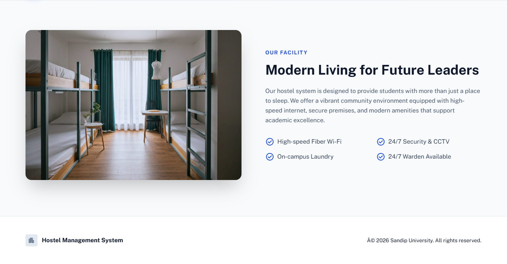

## Admin Login Page
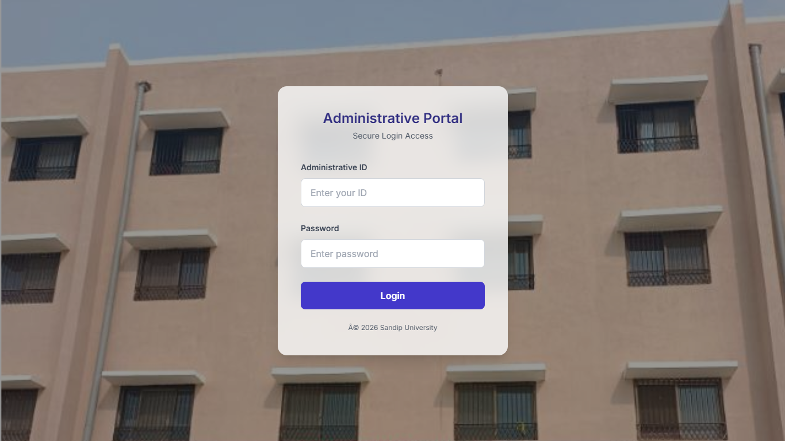

## Admin Dashboard Page
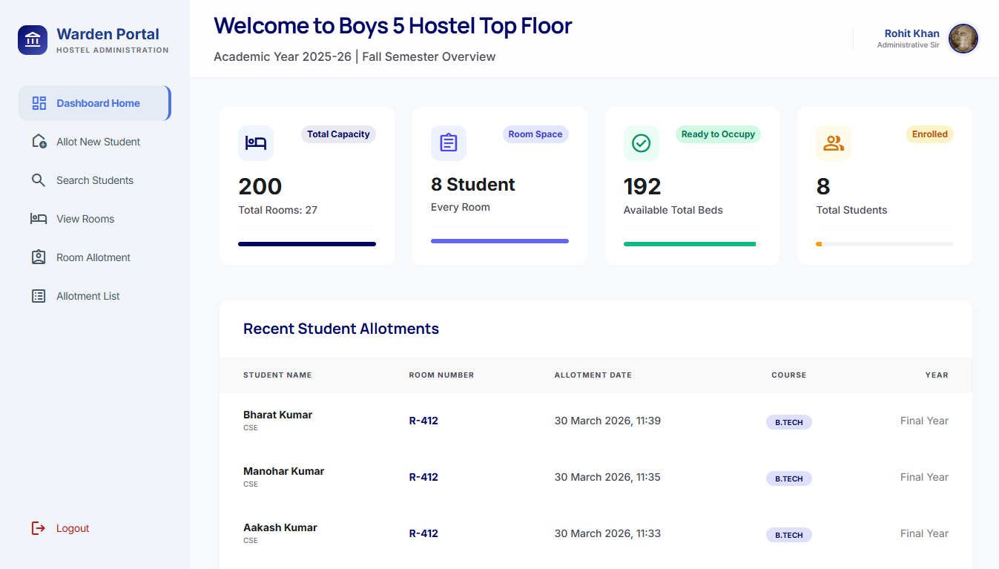

## Admin Privileges Page
### Allot New Room
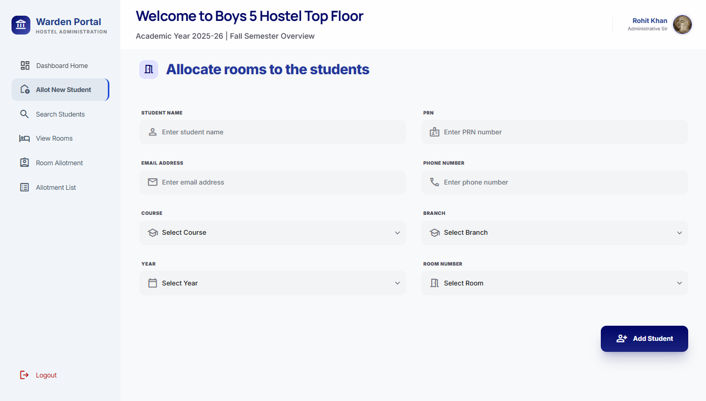

### Search Student Page
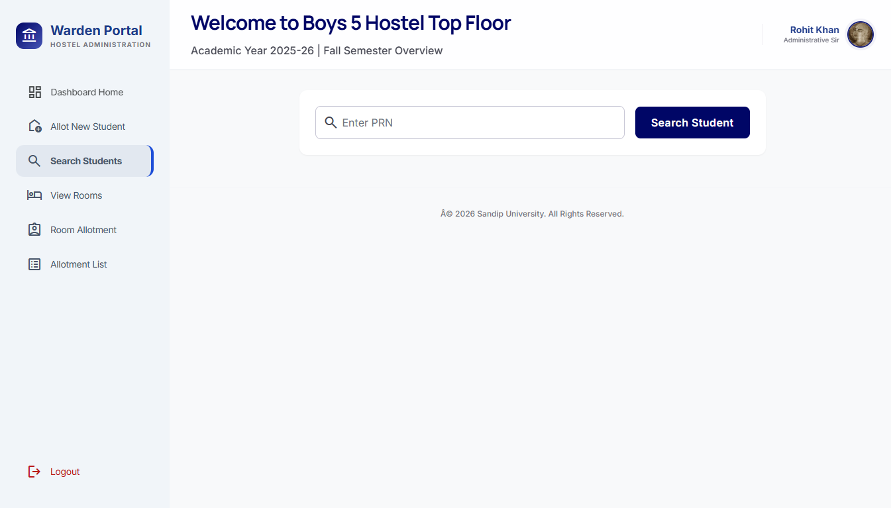

## Student Login Page
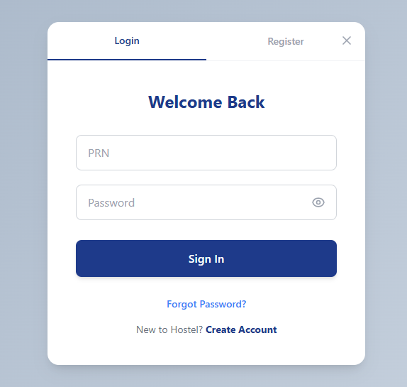

## Student Register Page
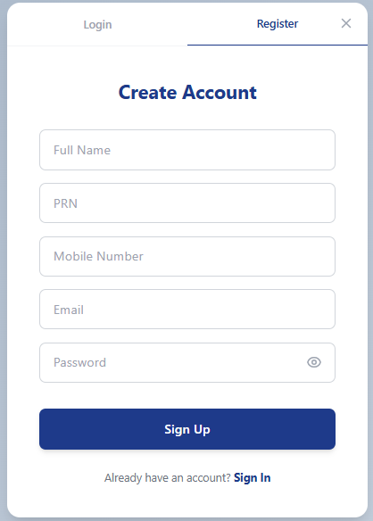

## Student Profile Page
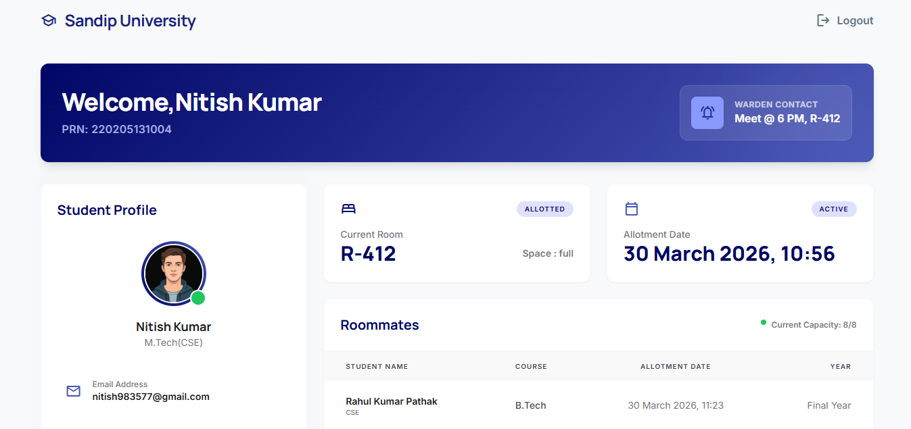
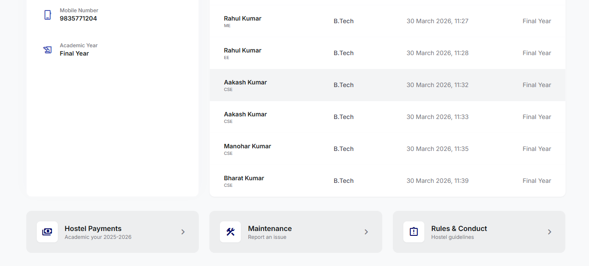

---

## 📘 Abstract
The Hostel Management System (HMS) is a secure and efficient web-based application designed to 
automate and simplify hostel administration processes. It replaces traditional manual record-keeping
methods with a centralized digital platform that manages student registration, room allocation, 
and complaint handling. The system enables administrators to efficiently maintain student records,
monitor room occupancy, and manage hostel operations in real time.

---

## 🎯 Objectives

- Provide a centralized digital platform for managing hostel operations efficiently.
- Reduce manual errors, paperwork, and administrative workload through automation.
- Ensure secure storage and quick retrieval of student and hostel-related information.
- Enable efficient monitoring of room occupancy, hostel records, and student Details.
- Enhance transparency, accuracy, and overall efficiency in hostel management.
- Provide a user-friendly system that offers fast and convenient access to hostel services.

---

## 🔑 Key Features

### ➤ Student Management
- Student registration with personal and academic details
- View and update student information

### ➤ Room Management
- Room allocation to students
- View room availability and occupancy status

### ➤ Security & Authentication
- Secure user login with username and password
- Role-based access control for administrators and students

---

## 🧩 System Modules

- **Student Registration Module** – For registering new students and maintaining their personal and academic details.
- **Login Module** – Secure access for students and administrators using authentication credentials.
- **Room Management Module** – For room allocation, room availability tracking, and occupancy management.
---

## 🛠️ Technologies Used

| Category       | Tools / Languages              |
|----------------|--------------------------------|
| Frontend       | HTML, CSS, JavaScript, JSP     |
| Backend        | Java (JDK 24), JDBC, Servlets  |
| Database       | Oracle 11g XE / MySQL 8.0+     |
| Web Server     | Apache Tomcat 9                |
| IDE            | IntelliJ IDEA / Eclipse        |
| OS             | Windows 10/11 or Ubuntu 20.04+ |
| Browser        | Ulaa / Chrome / Edge           |
| Cloud Hosting  | AWS EC2 (Ubuntu 20.04 LTS)     |
| Version Control| Git (Git Bash)                 |
| File Transfer  | FileZilla                      |

## ☁️ Deployment Architecture

- **Web Tier**: Apache Tomcat 9 on AWS EC2
- **Application Tier**: Java Servlet, JSP, JDBC
- **Database Tier**: MySQL (local or remote access)
- **Client Side**: Web browser (Chrome/Edge) via HTTP
- **Security**: AWS Security Groups for HTTP/HTTPS & MySQL (port 3306)

